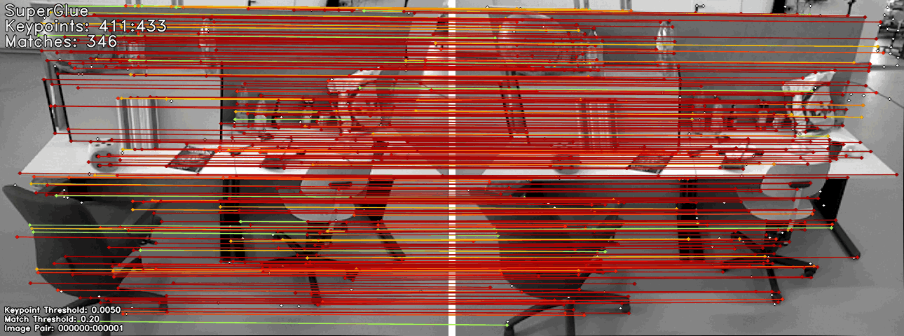

# efficient-feature-matching
Course project for 6.S965: TinyML &amp; Efficient Deep Learning Computing at MIT 2022.

## Get Started
For running and reproducing the experiments, please run the following Google Colab Notebook:      

You can download the required dataset from this link: [coco_minitrain_25k.zip](https://drive.google.com/file/d/14KhVa5Hfji-Kd6WBJ16bZs9kjLemJVSD/view?usp=sharing)

Please upload it to your own Google Drive in a folder at location `TinyML/coco_minitrain_25k.zip` or update the code accordingly.

## Demo
The following two sequences show a short demo of the dense (top) and the pruned model (bottom). The pruned model's size is reduced by a factor of 5x. For more details refer to the [report](report.pdf).

Dense Model

Pruned Model

## Code Overview
The repo contains code heavily based on the following three repos and the lecture/labs:

* [SuperGlue](https://github.com/magicleap/SuperGluePretrainedNetwork)
* [SuperGlue_training](https://github.com/gouthamvgk/SuperGlue_training)
* [pytorch-superpoint](https://github.com/eric-yyjau/pytorch-superpoint)
* [6.S965: Tiny ML & Efficient Deep Learning Computing](https://efficientml.ai)

On top of these, severals helper files and scripts have been added:

* `pruning/`: folder containing classes to apply different pruning methods
* `quantization/`: folder containing classes to apply different quantization methods
* `evaluate.py`: provides functions to evaluate pruned and quantized models
* `finetune.py`: provides functions to finetune the pruned models
* `helper.py`: various helper functions
* `match_pairs.py`: updated match_pairs file to make compatible with pruned models
* `profile.py`: script to profile dense and pruned models in terms of MACs, latency and model size
* `pruning_experiments.py`: code to perform sensitivity scans and experiments
* `quantization_experiments.py` code to perform quantization experiments
* `visualizations.py`: scripts that generate some of the plots

## Credits
[1] Paul-Edouard Sarlin, Daniel DeTone, Tomasz Malisiewicz, Andrew Rabinovich: “SuperGlue: Learning Feature Matching with Graph Neural Networks”, 2019; <a href='http://arxiv.org/abs/1911.11763'>arXiv:1911.11763</a>.

[2] Nermin Samet, Samet Hicsonmez, Emre Akbas: “HoughNet: Integrating near and long-range evidence for bottom-up object detection”, 2020; <a href='http://arxiv.org/abs/2007.02355'>arXiv:2007.02355</a>.

[3] [SuperGlue_training](https://github.com/gouthamvgk/SuperGlue_training)

[4] [pytorch-superpoint](https://github.com/eric-yyjau/pytorch-superpoint)

[5] [6.S965: Tiny ML & Efficient Deep Learning Computing](https://efficientml.ai)